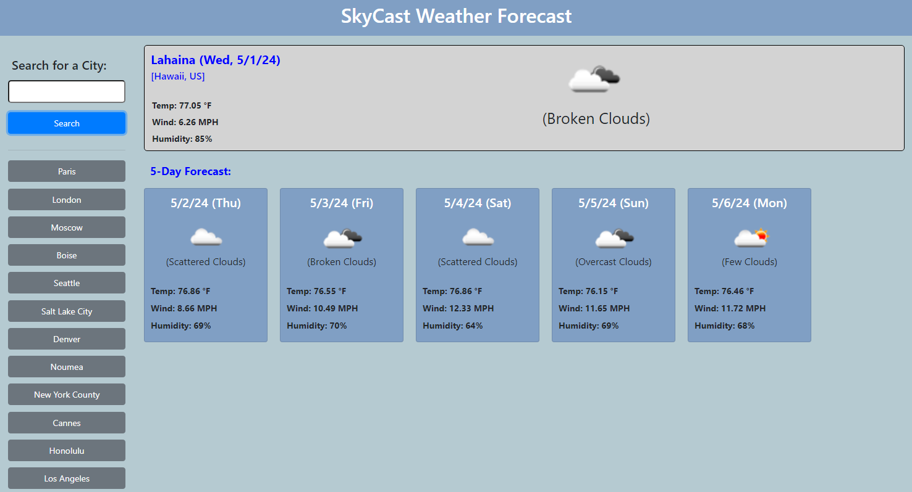

# Let's Make An SVG Logo

This app allows you to create an SVG Logo.

## Description

This app allows the user to create an SVG Logo.  The user is asked a few questions to decide what shape the SVG Logo should be and what color it should be.  After all the questions are answered, an SVG Logo is created.

## Image of My App
 

 
## Example SVG Logo
 

 
 ## License

This project is currently not licensed.